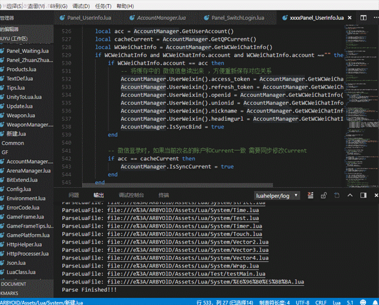
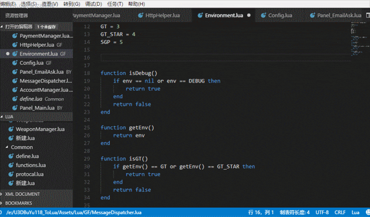
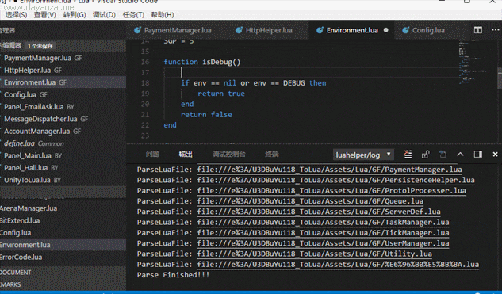
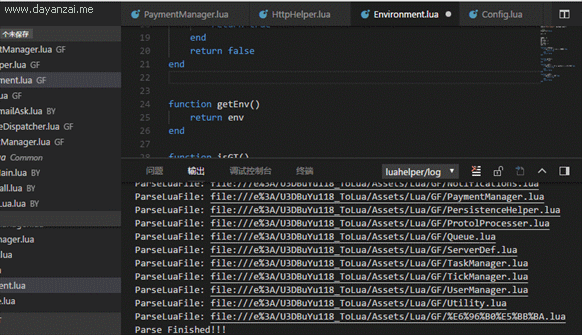

# Luahelper

LuaHelper is an vscode extension provide something features auxiliary for coding in lua language.

features like Snippet,Intelligence,GotoDefinition,CodeComplete etc.

support lua version 5.1 and 5.3.

## Features

- **符号定义跳转(goto definition)**

    

- **代码补全(code completion)**

    

- **语法错误检测(error checking)**

    

- **Lua代码片段提示(code snippets)**

    

## Extension Settings

Include if your extension adds any VS Code settings through the `contributes.configuration` extension point.

For example:

This extension contributes the following settings:

* `myExtension.enable`: enable/disable this extension
* `myExtension.thing`: set to `blah` to do something

## Known Issues

don't support chinese language to name file ;

## Release Notes

### 0.0.5

* Added features symbols completion;
* Fixed issue that catching excption in parsing empty file;
* Added features for support statement `module`;

### 0.0.4

Initial release version with features: global document analysis and gotoDefinition.

-----------------------------------------------------------------------------------------------------------
